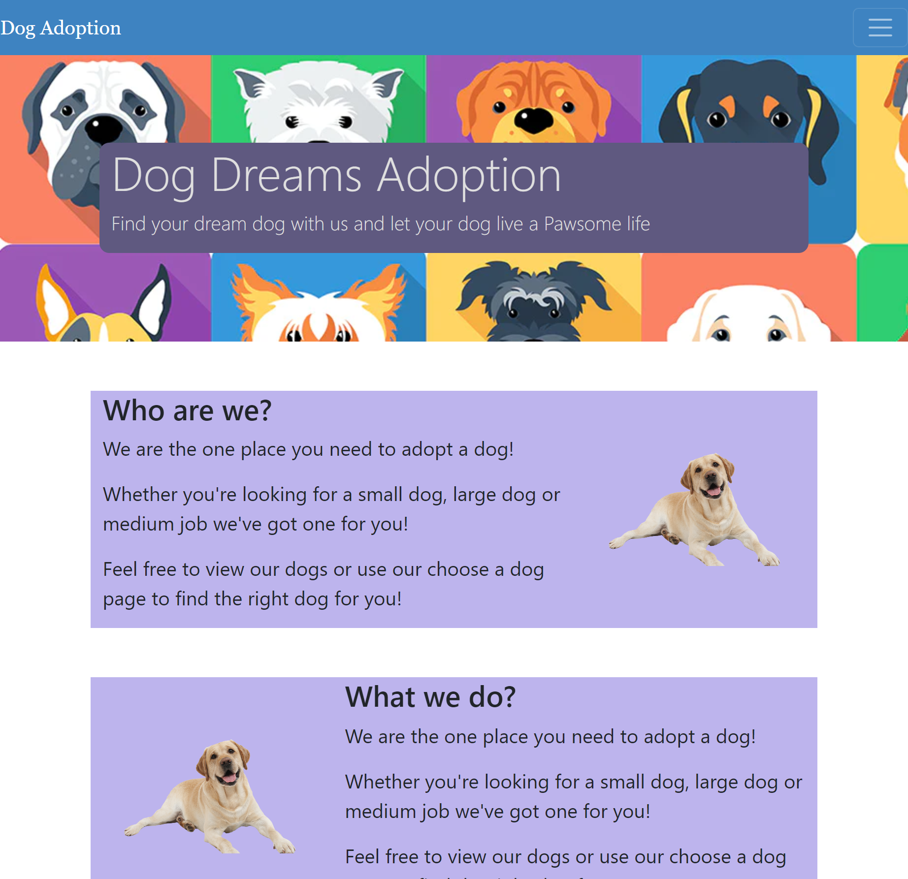

# Dog Adoption Mockup Website

## Description

I built this project for one major reason, practice. I learnt a lot of new skills throughout the trilogy Skills 16 week bootcamp in front-end web development. To reinforce that learning however I needed to make sure I made new projects and use the skills I learnt whilst also hopefully learning a few new ones along the way. This project was the main step in this practice, it is a mock-dog adoption website where you can view dogs using the dog api and also choose a dog by liking and disliking on an array of dogs and then being able to view this list of dogs that you like. I reached MVP on this project on 04.09.23. It was made in react and I learnt a lot more about it and the ways in which it could be utilised.

This project unfortunately took a while to work on due to job searching however, I was able to give it a last push at the end to ensure it got finished. I think there is a lot done well on this website within the limitations of not using a custom database which, in a real world application, would be used instead of an api. This would give me greater control and would also allow an easy expansion of the MVP to include listing the price of each adoption and adding a shopping kart that you could view and checkout. This may be something I come back and revisit in the future. I learnt a lot throughout this project and think it has reinforced my learning of the fundamentals learnt on the front-end development bootcamp. In the future, and on a possible revisitng of the web-page, I would like to try and improve my design skills through exposure and making more whilst studying design principles.

## Deployment

Github repository: https://github.com/NotGeorgeHere/dog-practice-website

Deployment Link: http://NotGeorgeHere.github.io/dog-practice-website
